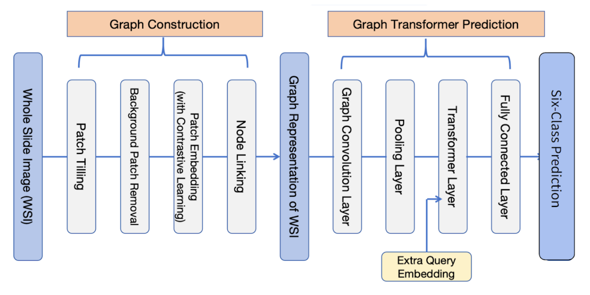

# Prostate cANcer graDe Assessment (PANDA) Challenge

As a part of our EC500 Medical Imaging with AI course, we attempt to solve the task outlined in the [Prostate CANcer graDe Assessment (PANDA) challenge](https://www.kaggle.com/c/prostate-cancer-grade-assessment/overview). The goal of the challenge is to develop a model to quantitatively estimate the severity of prostate cancer (PCa) based on prostate tissue biopsies. 

## Table of Contents
- [Installation](#installation)
- [Usage](#usage)
- [Data](#data)
- [Model Architecture](#model-architecture)
- [Training](#training)
- [Evaluation & Results](#evaluation--results)

## Installation

Use `environment.yml` to help you: 
```bash
conda env create -f environment.yml [-n new_env_name]
```

## Usage
To train the feature extractor and build the graphs, enter `/src` and run `{1,2,3,4}_run.py`, which serves as an entrance to each step, one by one. Change the file paths as you may. 

To train the GTP model, simply run 
```./scripts/model_train.sh```

## Data
Details of the dataset used for the PANDA challenge can be found [here](https://www.kaggle.com/c/prostate-cancer-grade-assessment/data).

## Model Architecture
Zheng et al have developed a repository containing a pytorch implementation of deep learning based graph transformer (GT) for whole slide image (WSI) classification that can be found [here](https://github.com/vkola-lab/tmi2022/blob/main/README.md). Details of the implementation can be found in this [paper](https://ieeexplore.ieee.org/document/9779215).

Below is the workflow we have made:  


|                                |                     **Input(s)**                    |              **Output(s)**             |
|:------------------------------:|:---------------------------------------------------:|:--------------------------------------:|
|        **Patch Tiling**        |                   Individual WSIs                   |            Deep Zoom patches           |
| **Feature Extractor Training** |           All patches from different WSIs           | Trained SimCLR feature extractor model |
|     **Graph Construction**     | Grouped patches and a pre-trained feature extractor |    Graph representation of each WSI    |
|    **Transformer Training**    |  Feature node matrix, adjacency matrix, and labels  |     6-class ISUP grade predictions     |

## Training


## Evaluation & Results
